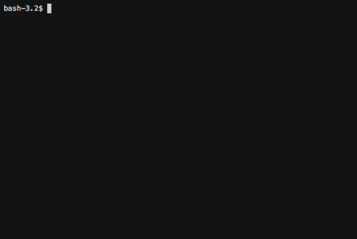

# Reverse Index GREP

## Get Started
Go to the directory of your choice, then use the `git clone` command to get a local clone of this repo.

## Usage

After cloning this repo, you should get yourself a Linux terminal. Kidding :)

You should first run [`rigrepdb.py`][rigrepdb] with the first argument as the folder/directory you want to index or "crawl".
This will create the necessary `.index` file which will be used by [`rigrep.py`][rigrep] afterwards.

Run [`rigrep.py`][rigrep] with the word you are looking for as the first argument.

[rigrepdb]: src/rigrepdb.py
[rigrep]: src/rigrep.py
